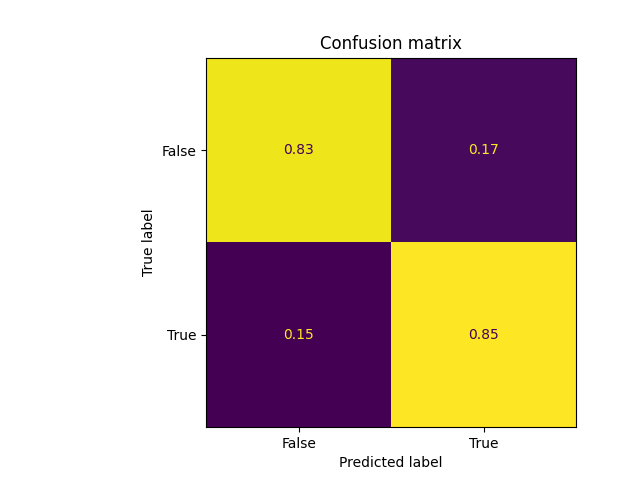

# League of Legends Modeling - Predicting the victor before the end of the game
### Creator: Ryan Hung
---
## Framing the Problem:
### Problem:

This modeling notebook employs **[Oracle Elixir's](https://oracleselixir.com/tools/downloads)** dataset consisting of player and team data from the 2022 League of Legends competitive season.

The data used here has already been cleaned in the exploratory data analysis found **[here](https://ryanhungry.github.io/league-of-legends-EDA/)**.

League of Legends is a highly complex game, and victory is typically determined through various factors. 

This modeling notebook focuses on creating a **binary classifier** to predict whether or not a team will win or lose a game before it has ended. We will be using the **response variable** `result`, which is a boolean column where `True` represents a win and `False` represents a loss. We are using `result` as our response variable because it directly relates to our problem of predicting whether or not a team will win.

We will be utilizing **accuracy** over other metrics such as precision, recall, or F1 score because predicting a false positive or a false negative is equally bad in our case. Moreover, there is no class imbalance in our data. In other words, the proportion of teams that win is roughly equal to the proportion of teams that lose in our dataset. To better visualize this, we provide a plot of the class distribution in our training set:

<iframe src="assets/class-distribution.html" width=800 height=600 frameBorder=0></iframe>

Lastly, we need to specify what features are available at the **time of prediction**. In our model, we will be using the features `firstbaron`, `firstblood`, and other features captured at the 15-minute mark of a match. All of these features are available during the time of prediction because we have access to them before the game has finished. In other words, there is no information that is only available after the game has ended.

---
## Baseline Model:
### Baseline Model:
The model we are using is **logistic regression** because it is best used for binary classification problems. 

For the baseline model, we are using **two quantitative discrete** features `firstbaron` and `firstblood`. These two features are boolean True/False features, so we can use one-hot encoding to represent them as numerical 0/1s. To do so, we used `Onehotencoder`, put it inside a `ColumnTransformer`, listed the columns `firstblood` and `firstbaron`, and then bundled everything into a `Pipeline` with our `LogisticRegression` model.

We chose these two features for our baseline because getting the first baron or the first blood benefits a team, and so there is an intuitive positive correlation between getting these objectives and winning.

After fitting our model on the training set and then evaluating accuracy on the test set, we achieve a **baseline accuracy of 0.8199**. This performance is good as a baseline given we are only using two features. We achieved this decent baseline performance because our assumption of first baron and first blood benefitting team is correct. 

---
## Final Model:
### Final Model:
For our final model, we are adding two additional features to our original baseline model:
1. We engineer the feature `kda_diff_at_15`, which is the difference between a team and their opponent's $KDA = \frac{kills + assists}{deaths + 1}$ at the 15-minute mark (we use smoothing to avoid division by zero). We then standardize to shrink the range to make our coefficients more interpretable when compared against other features. This feature is good with respect to the DGP because KDA is a measure of a team's performance against another team. Having a higher KDA - positive difference - than the other team means that you are eliminating them more than they are eliminating you, which is important in determining the winner.
2. We standardize the feature `xpdiffat15`, which is the difference between experience gained betwen a team and its opponent. We standardize this feature because it is normally distributed and has a large range - about 15k. This shrinks the scale of `xpdiffat15` to make our model converge faster and makes our coefficients more understandable with respect to other features. Intuitively, this feature is good with respect to the DGP because a team with more experience gained has access to higher levels that make their champions stronger. This is very important at the 15-minute mark because experience is a better resource at earlier stages of the game than gold - because gold income is slower during early stages.

We maintain using a **logistic regression model** so we can compare the difference in performance of engineering these features. In addition, logistic regression is solid for binary classification.

For hyperparameter tuning, we used 10-fold grid search cross-validation to determine the best `solver` hyperparameter out of the following:
- According to documentation, `liblinear` is good for small datasets and `sag` and `saga` are better for larger ones so we want to try them to see how they would fare on a dataset the size of `lol_cleaned`
- According to documentation, `liblinear` uses one-versus-rest schemes, which essentially trains two logistic regression models on both the postitive and negative class, meaning it is best used for binary classification like our problem
- We are keeping `lbfgs` as it is the default `solver` hyperparameter

As a result of our cross-validation, **we select `liblinear` as our hyperparameter**.

After putting our newly engineered features into a pipeline and specifying `liblinear`, we obtain a final accuracy of **0.831**. This is only a minimal improvement over our baseline model, and it might suggest that 15-minute KDA and experience difference might not have strong correlations in deciding who wins or loses a match. Maybe later stages of the game are more impactful in winnter determination, but we would have to gather more data...

Here is a normalized confusion matrix of our final model:

---
## Fairness Analysis:
### Fairness Analysis:

We will be assessing our final model's fairness on two groups:
1. Teams that have killed the first baron
2. Teams that did not kill the first baron

We will be measuring the **accuracy** of our model on these two groups to determine fairness using the following permutation test:
- Null hypothesis: Our model is fair. Its accuracy for teams that got first baron is equal to that of teams who did not get first baron.
- Alternative Hypothesis: Our model is unfair. Its accuracy for teams that got first baron is greater than that of teams who did not get first baron.
- Test statistic: Difference in accuracy (firstbaron - no firstbaron)
- Significance level: 0.01

Here is the result of our permutation test:

<iframe src="assets/fairness-test.html" width=800 height=600 frameBorder=0></iframe>

Our permutation test resulted in a p-value of **0.1733**, which is greater than our significance level of 0.01 so we **fail to reject the null hypothesis**. Thus, there is statistical evidence that implies our model is fair with respect to a team getting or not getting first baron - however, this is not an absolute conclusion.